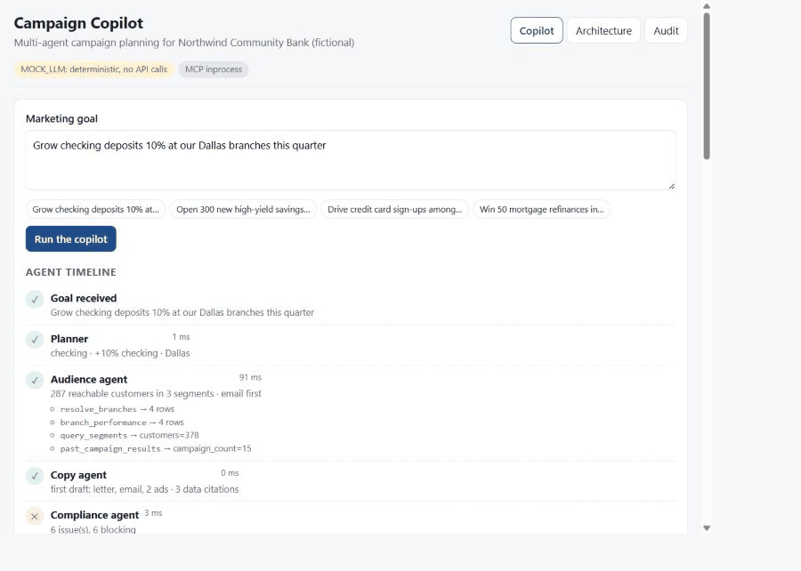

# Campaign Copilot

**A bank marketer types a goal. Five agents plan the campaign, pull the numbers, write the copy,
check it against the compliance rulebook, score it, and then stop and wait for a human to
approve. Every step lands in a tamper-evident audit log.**

Built for a fictional bank, **Northwind Community Bank**, on synthetic data. This is independent
portfolio work by Akhil Reddy Gaddam and is not affiliated with any real company.



## The 30-second version

| What you see | What is happening |
|---|---|
| A goal such as *"Grow checking deposits 10% at our Dallas branches this quarter"* | The **planner** turns it into a product, a target, a location and a timeframe. |
| Four tool calls under "Audience agent" | The **audience agent** asks an **MCP server** for branches, customer segments and past campaign economics. It never sees SQL. |
| A letter, an email and two digital ads | The **copy agent** drafts them and says which data point drove each choice. |
| Red highlights and policy citations | The **compliance agent** runs a deterministic rulebook and cites the retrieved policy paragraph for every flag ("Policy 1.1, misleading claims"). |
| "revise (1/2)" then "accept" | The **evaluator** scores the draft and sends it back at most twice. |
| Approve / Reject buttons | LangGraph pauses before the `publish` node. Nothing ships without a click. |
| Business impact panel | Reach, projected accounts and cost per account, computed from the synthetic history and labelled as estimates. |
| Audit tab, "chain intact" | Each log line hashes the previous one. Edit any line and verification fails at that line. |

## Run it in two commands

```bash
python manage.py test      # builds the synthetic data and runs the 36 tests, offline
python manage.py api       # http://localhost:8000  (serves the built UI from frontend/dist when present)
```

For the live-reload front end during development:

```bash
cd frontend && npm install && npm run dev     # http://localhost:5173, proxies /api to :8000
```

First-time setup, if you do not have a virtual environment yet:

```bash
python -m venv .venv && .venv/Scripts/pip install -e ".[dev]"    # Windows
python -m venv .venv && .venv/bin/pip install -e ".[dev]"        # macOS / Linux
```

**No API key is needed.** `MOCK_LLM=1` (the default) swaps the model for deterministic stand-ins,
so the demo, the tests and the evals run offline and cost nothing. To use a real model, copy
`.env.example` to `.env`, set `MOCK_LLM=0` and an `ANTHROPIC_API_KEY`. The code path is the same;
only the model client changes.

`make <target>` works if GNU make is installed. `manage.py` has the same targets for Windows.

## Architecture

```
React + Vite ──SSE/JSON──▶ FastAPI ──▶ LangGraph StateGraph (MemorySaver, recursion_limit 25)
                                        planner → audience → copy → compliance → evaluator ─┬─▶ publish
                                                     ▲                                       │
                                                     └──────── revise (max 2) ───────────────┘
                                                                           interrupt_before=["publish"]
         audience agent ──MCP (stdio or in-process)──▶ Northwind MCP server ──▶ SQLite, read-only
         compliance agent ──BM25 retrieval──▶ policies/*.txt (five plain-text policies)
         every node ──▶ logs/audit.jsonl (SHA-256 hash chain)
         every agent ──▶ Claude via structured outputs, or MockLLM when MOCK_LLM=1
```

The Architecture tab in the UI has the same diagram with notes. More detail: `docs/EXPLAIN.md`.

| Layer | Where | Notes |
|---|---|---|
| Synthetic data | `campaign_copilot/data/` | 5,000 customers, 12 branches, 48 past campaigns. Seeded, byte-identical on rebuild. No names, addresses or protected attributes. |
| MCP server | `campaign_copilot/mcp_server/server.py` | `MCPServer` from the MCP Python SDK 2.x. Four tools. Run it with `python -m campaign_copilot.mcp_server.server` or open it in the MCP Inspector. |
| Agents | `campaign_copilot/agents/` | Prompts in `prompts.py`, output schemas in `schemas.py`, node functions in `nodes.py`. |
| Workflow | `campaign_copilot/graph.py`, `runner.py` | Graph definition, routing, checkpointer, approval gate. |
| Compliance | `campaign_copilot/compliance/`, `policies/` | Rule checker plus BM25 retrieval over the policy paragraphs. |
| Audit log | `campaign_copilot/audit/log.py` | Append-only JSONL with hash chaining and a verifier. |
| API | `campaign_copilot/api/main.py` | Runs, SSE events, decisions, audit, policies. |
| UI | `frontend/` | React + TypeScript + Vite. No UI framework. |
| Evals | `evals/` | 20 golden goals, scored offline. `python manage.py eval`. |

## Engineering quality

- **Tests:** 36 pytest tests cover the data, the queries, the MCP server through a real MCP client,
  the compliance rules, the audit chain (including tamper detection), the mock model, the full
  graph, and the HTTP API. `python manage.py test`.
- **Evals:** `python manage.py eval` runs 20 marketer goals and checks 12 to 13 properties each
  (product detected, right branches, compliance passed, accepted within the revision cap, data
  cited, disclosures present, no protected-class language, impact estimated). It prints a score
  table and exits non-zero below the threshold in `evals/baseline.json`. The suite found four real
  bugs while being written; see `docs/DECISIONS.md`.
- **CI:** `.github/workflows/ci.yml` runs ruff, pytest, the evals, and the front-end build on every
  push and pull request.
- **Lint:** `ruff check .` and `ruff format --check .` are clean.

## Design decisions and tradeoffs

- **Deterministic compliance, model-assisted fixes.** Whether copy says "guaranteed" is not a
  judgement call, so rules decide and retrieval cites the paragraph. The model only proposes
  rewrites. A model-only compliance check would be easier to write and impossible to audit.
- **MCP between agents and data.** Four typed tools are the whole data surface. The same server
  works from Claude Desktop or the MCP Inspector, and every call is logged with its arguments.
  Cost: one more process and protocol hop. Benefit: agents cannot run arbitrary SQL.
- **Mock mode is a first-class backend, not a test stub.** The mock produces the same schema
  objects as the real model and deliberately writes a flawed first draft, so the revision loop is
  visible offline. Tradeoff: the mock's copy is templated and will read as such.
- **LangGraph interrupt for approval.** `interrupt_before=["publish"]` with a checkpointer gives a
  real pause-and-resume rather than a UI-only gate. The in-memory checkpointer loses runs on
  restart; swap in a database checkpointer for production.
- **BM25 over five text files instead of embeddings.** The rulebook is tiny and exact wording
  matters. Standard library only, deterministic, no vector database to run.
- **Honest numbers.** Projections come from the synthetic campaign history and are shown with
  decimals rather than rounded up. The dataset holds customers only, so single-branch audiences
  are small; a real deployment would add prospect lists.
- **Official Anthropic SDK with structured outputs** rather than a framework wrapper, so the model
  call is one readable function and the response is guaranteed to validate against the schema.

## Repository map

```
campaign_copilot/   Python package (data, mcp_server, agents, compliance, audit, graph, runner, api)
frontend/           React + TypeScript + Vite UI
policies/           The compliance rulebook, five plain-text files
evals/              Golden goals, baseline threshold, runner
tests/              pytest suite
docs/               EXPLAIN.md (plain-English walkthrough), DECISIONS.md, screenshots
manage.py           Cross-platform task runner (data, test, lint, eval, api, check)
```

## Status

| Module | State |
|---|---|
| Synthetic data (5,000 customers, 12 branches, 48 past campaigns) | done |
| MCP server (`resolve_branches`, `query_segments`, `branch_performance`, `past_campaign_results`) | done |
| LangGraph workflow (planner, audience, copy, compliance, evaluator, human approval) | done |
| Hash-chained audit log | done |
| FastAPI backend and React front end | done |
| Golden evals and CI | done |
| Campaign visuals in `assets/` (generated separately, not part of the demo) | pending |

## License

MIT. See `LICENSE`.
